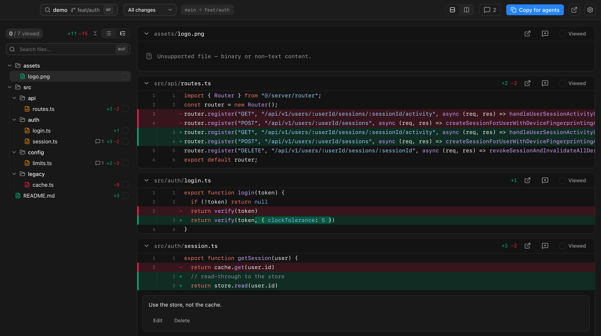

<div align="center">

# Δ&nbsp;&nbsp;delta

**Review code diffs. Leave structured comments for your agents.**



</div>

---

delta is a fast, native-feeling desktop app for reviewing git changes. Read the
diff, drop comments on the exact lines that matter, then copy the whole review
as clean Markdown your AI coding agent can act on — no copy-pasting line numbers,
no losing track of what you asked for.

## ✨ Features

- 🚀 **Fast diffs** — Smooth on huge changesets. Unified or split, word-level
  highlighting, syntax colors, fold/expand context, and find-in-diff with
  match-case and whole-word.
- 💬 **Comments that stick** — Comment on a line, a range, or a whole file. Edit
  them inline as Markdown, resolve them once they're handled, and they re-anchor
  as the diff shifts under you — drift too far and they flag themselves *stale*
  instead of silently pointing at the wrong place.
- 🤖 **Copy for agents** — One click turns the review into clean, line-anchored
  Markdown ready to paste into an agent. Resolved comments drop out; stale ones
  are flagged, not lost.
- 🌿 **Git-native** — Review all changes, just what's uncommitted, the last
  commit, or your branch against its base. Worktree-aware, and it watches the
  working tree so a single keystroke re-diffs the moment files change.
- 🧭 **Made for flow** — Browse changed files as a tree or flat list, mark files
  viewed as you go, jump to any file in your editor, and use the command palette
  to hop between recent reviews.
- 🎨 **Light & dark** — System, light, or dark theme.

## 🤖 Copy for agents

The reason delta exists. Every comment becomes a self-contained instruction with
its location and the code it refers to, grouped by file — so an agent has
everything it needs without the original diff in front of it:

````markdown
# Review — acme/api · feat/sessions · branch-vs-base
Base 8f2a1c0 ⇢ head 3e9b4d1 · captured 2026-06-29T10:12:00Z

## src/auth/session.ts

#### L2
```ts
return cache.get(user.id)
```
Use the store, not the cache.

#### L40–48 · ⚠ stale
```ts
export const TTL = 3600
```
Make this configurable.
````

## 🚀 Run it

macOS for now. Needs [Rust](https://www.rust-lang.org/tools/install),
[Node](https://nodejs.org), and [pnpm](https://pnpm.io).

```bash
pnpm install
pnpm tauri dev      # run the app
pnpm tauri build    # build a bundle
```

## 💻 Review from your terminal

Install the `delta` CLI with the one-click **Install CLI** button in the app
header (or from the first-run screen). Then run it from any repo or worktree —
ideal for reviewing an agent's work the moment it finishes:

```bash
delta                    # review the current repo — all changes
delta --uncommitted      # only staged + unstaged changes
delta --last-commit      # just the most recent commit
delta --branch           # current branch vs. its base
```

A path can follow any of these, e.g. `delta --branch ../other-checkout`.

## 🛠️ Development

```bash
pnpm dev:mock     # run the whole UI in a browser against fixtures → localhost:5599
pnpm test         # UI tests · cargo test in src-tauri/ for the backend
```

Architecture and conventions live in [CLAUDE.md](CLAUDE.md). PRs welcome — keep
changes scoped and the tests green.

## Built with

[Tauri 2](https://tauri.app) · [React 19](https://react.dev) · [Vite](https://vite.dev) · [Tailwind v4](https://tailwindcss.com) · [@git-diff-view](https://github.com/MrWangJustToDo/git-diff-view)

## License

[MIT](LICENSE) © Dario Ielardi
