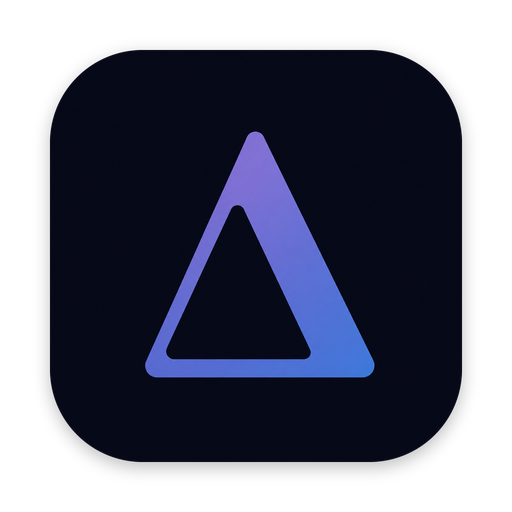
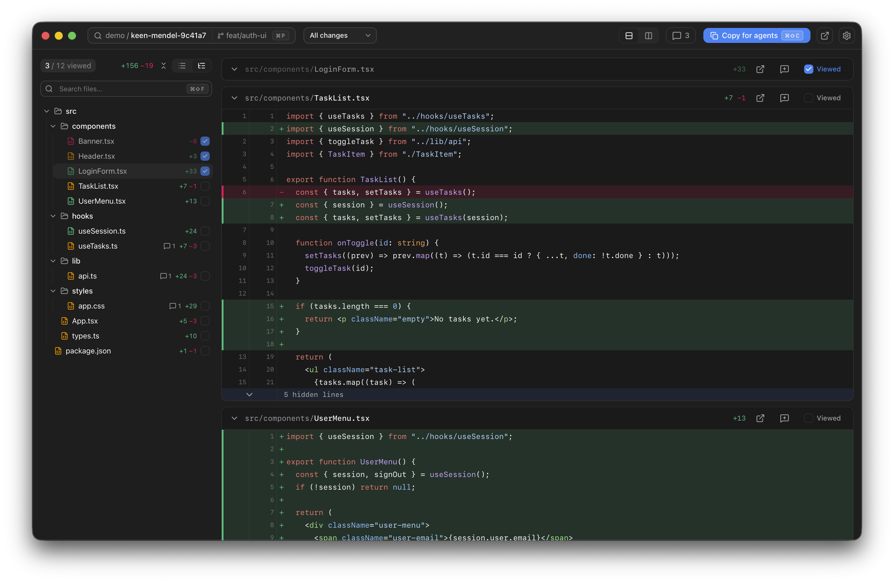

<div align="center">



# delta

**Review code diffs. Leave structured comments for your agents.**



</div>

---

**delta** is a fast, beautiful desktop app for reviewing git changes. Read the
diff, drop comments on the exact lines that matter, then copy the whole review
as clean Markdown your AI coding agent can act on.

## ✨ Features

- 🚀 **Fast diffs** — Smooth on huge changesets. Unified or split, word-level
  highlighting, syntax colors, fold/expand context, and find-in-diff.
- 💬 **Comments that stick** — Comment on a line, range, or whole file in
  Markdown. They re-anchor as the diff shifts and flag themselves *stale* rather
  than silently drift. Resolve them once they're handled.
- 🤖 **Copy for agents** — One click turns the review into clean, line-anchored
  Markdown an agent can act on — resolved comments drop out, stale ones are
  flagged. *(See below.)*
- 🌿 **Git-native** — All changes, just uncommitted, the last commit, or
  branch-vs-base. Worktree-aware, and it re-diffs the moment files change.
- 🧭 **Made for flow** — Files as a tree or list, mark-as-viewed, jump to your
  editor, command palette to hop between reviews.
- 🎨 **Light & dark** — System, light, or dark theme.

## 🤖 Copy for agents

The reason **delta** exists. Every comment becomes a self-contained instruction with
its location and the code it refers to, grouped by file — so an agent has
everything it needs without the original diff in front of it:

````markdown
# Review — acme/api · feat/sessions · branch-vs-base
Base 8f2a1c0 ⇢ head 3e9b4d1 · captured 2026-06-29T10:12:00Z

## src/auth/session.ts

#### L2
```ts
return cache.get(user.id)
```
Use the store, not the cache.

#### L40–48 · ⚠ stale
```ts
export const TTL = 3600
```
Make this configurable.
````

## 🚀 Installation

You can download the latest release from the [releases](https://github.com/darioielardi/delta/releases) page, brew coming soon!
macOS only for now.

## 💻 Open from your terminal

Install the `delta` CLI with the one-click **Install CLI** button. Then run it from any repo or worktree —
ideal for reviewing an agent's work the moment it finishes:

```bash
delta                    # review the current repo — all changes
delta --uncommitted      # only staged + unstaged changes
delta --last-commit      # just the most recent commit
delta --branch           # current branch vs. its base
```

A path can follow any of these, e.g. `delta --branch ../other-checkout`.

## 🛠️ Development

```bash
pnpm dev:app                   # the app, isolated as "Delta Dev" — won't clash with an installed release
pnpm dev:mock                  # just the UI in a browser against fixtures → localhost:5599
pnpm start:demo                # build a throwaway review repo + open it (start:demo:stress for a giant one)
pnpm test                      # UI tests
cd src-tauri && cargo test     # Rust backend tests
```

`dev:app` runs the dev build as a separate app — its own identifier, data dir, and
`delta-dev` CLI — so you can hack on delta while using a release build for real
work. (`pnpm tauri dev` works too, but shares the release's identity.)

Architecture and conventions live in [CLAUDE.md](CLAUDE.md). PRs welcome — keep
changes scoped and the tests green.

## Built with

[Tauri 2](https://tauri.app) · [React 19](https://react.dev) · [Vite](https://vite.dev) · [Tailwind v4](https://tailwindcss.com) · [@git-diff-view](https://github.com/MrWangJustToDo/git-diff-view)

## License

[MIT](LICENSE) © Dario Ielardi
